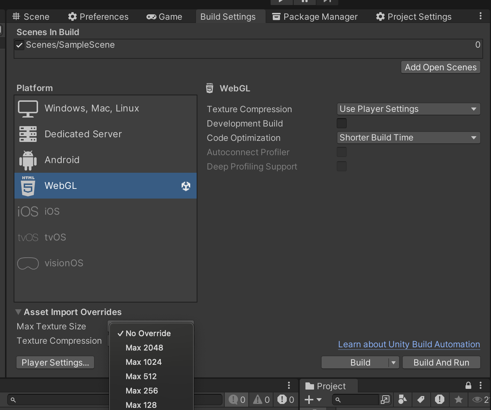
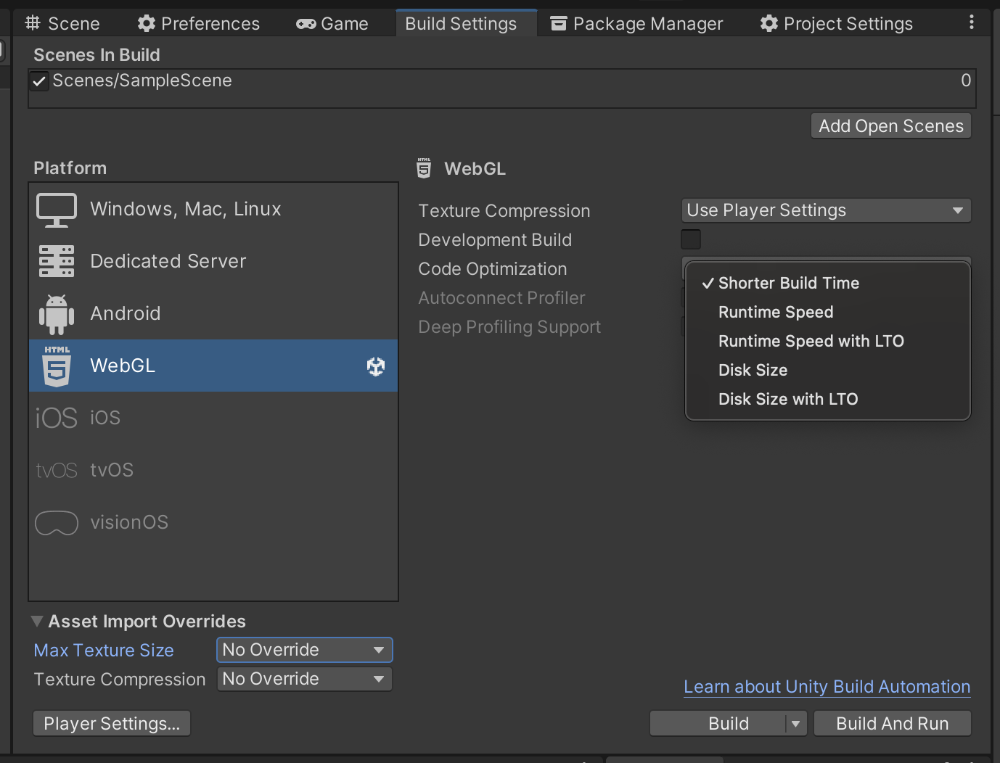
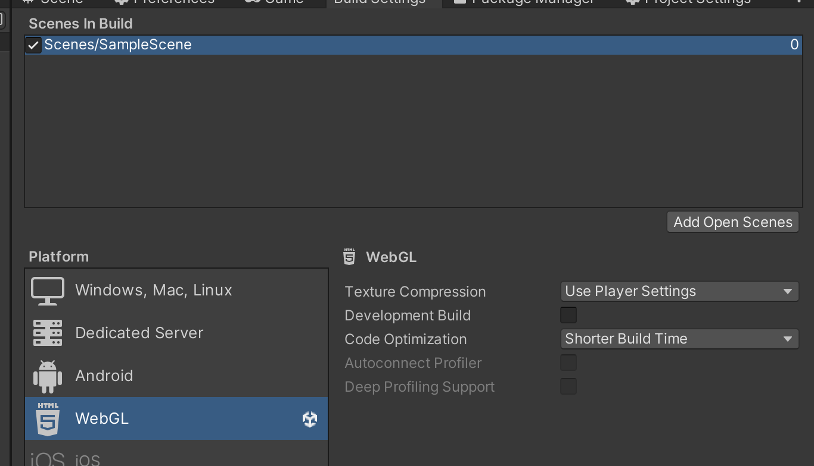
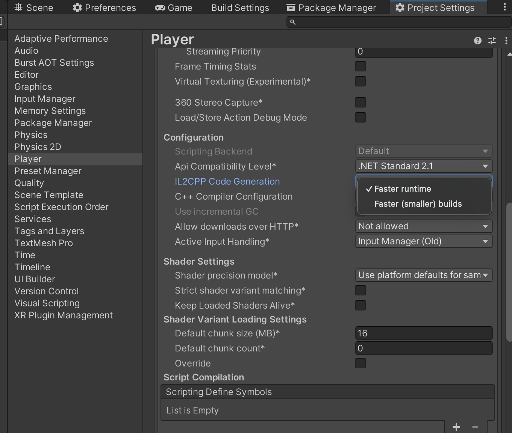
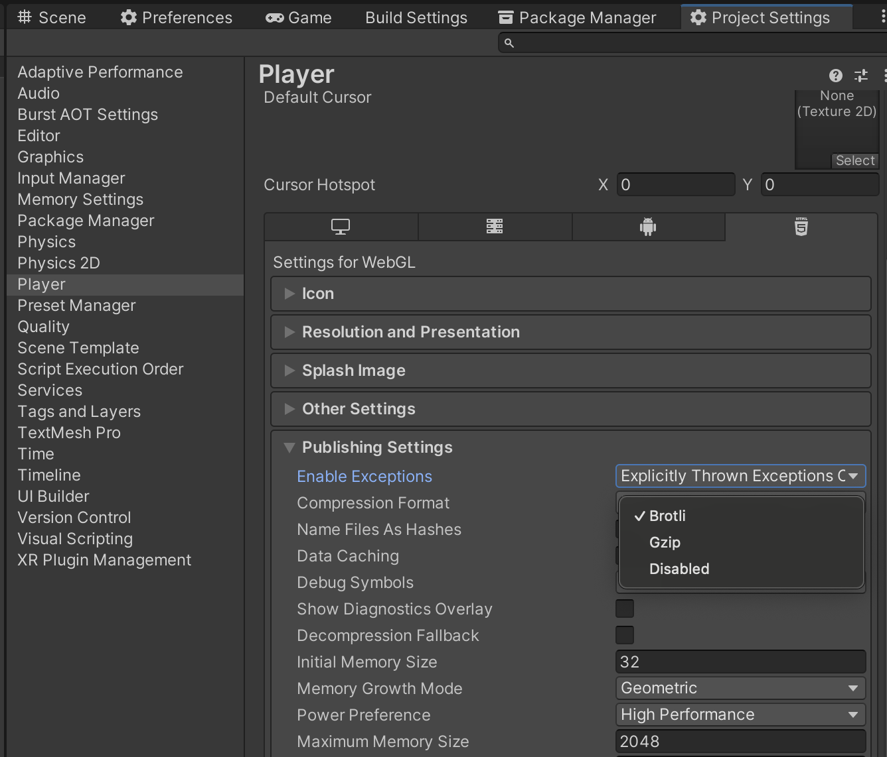
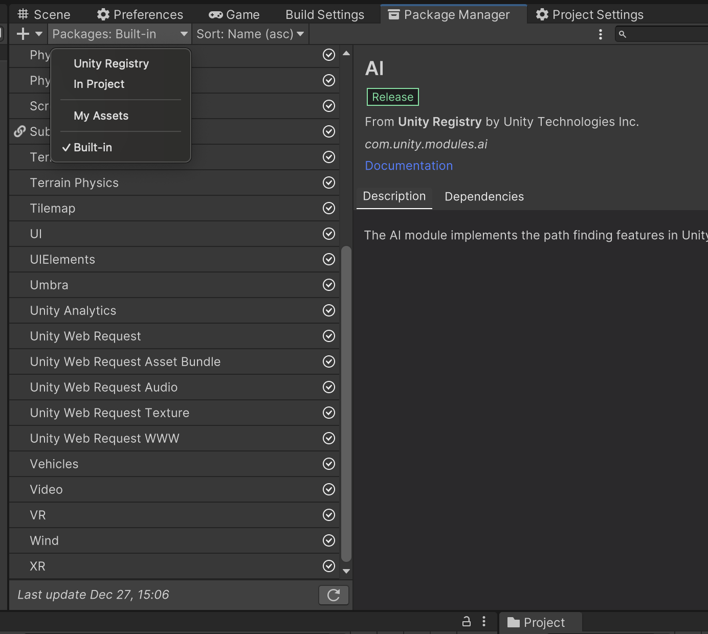
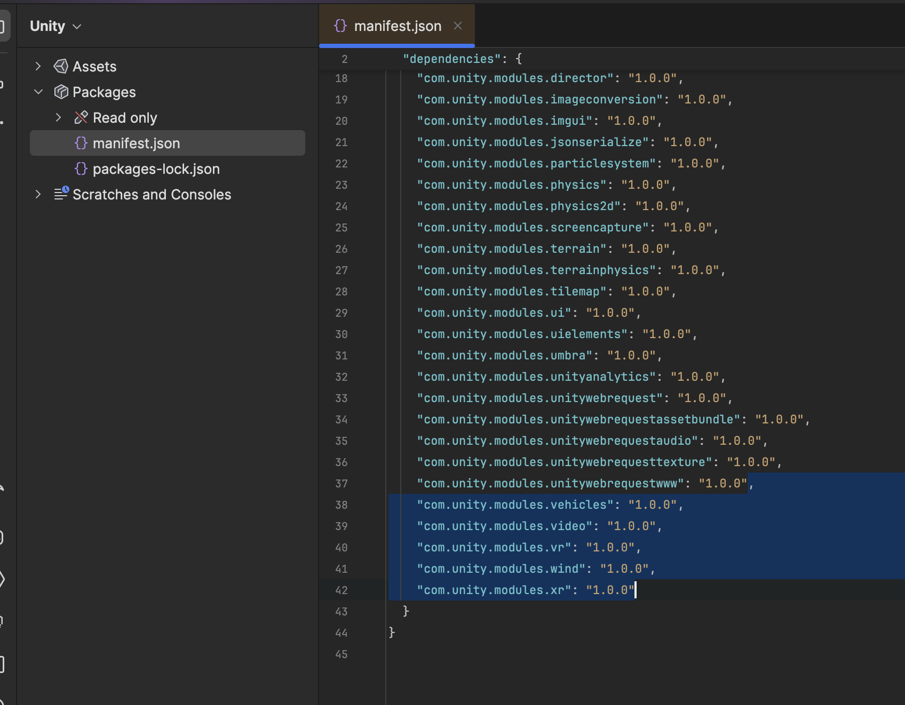
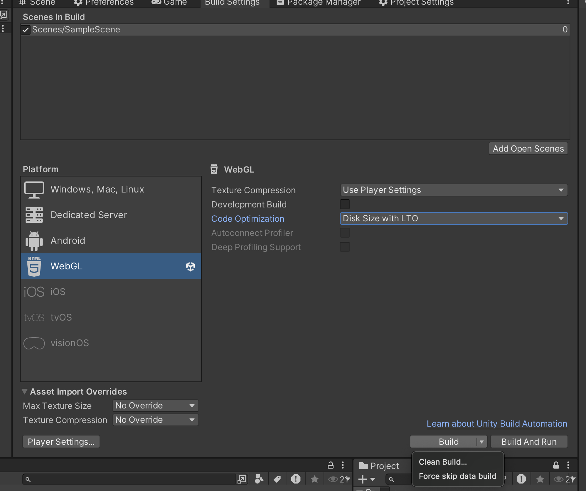

## Настройки проекта

### * Вкратце и поверхностно, на коленочке написано :3 Обязательно пройдись по ссылкам всем, в каждом есть инфа котора может помочь именно в твоем кейсе.

### Специальные зарезервированные unity папки проекта

У Unity есть много специальных зарезервированных папок, две из таких напрямую могут влиять на размер сборки.
Что бы не лежало в папках StreamingAssets и Resources, оно попадет в билд по этому:
- [ ] Папка **StreamingAssets** (если есть) -  нужно убрать из нее все лишнее.
- [ ] Папки **Resources** (если есть) -  нужно убрать из нее все лишнее.

### Ограничение размера спрайтов и текстур в редакторе
- [ ] Ограничить все ресурсы проекта, включая readonly плагины в 512х512 или 1024х1024
  

### Build Settings
- [ ] Режим упаковки кода (Code Optimization) ставь **Disk Size** или **Disk Size LTO**
  
- [ ] Удалить лишние или не используемые сцены с (Scenes in Build) так как они идут в билд
  
- [ ] У IL2Cpp Code Generation выбрать режим **Faster (smaller) builds**
  
- [ ] Протестировать конкретно под свой проект режим GZip, если размер уменьшился, оставляй его, если увеличился, значит Brotli, тут уже от проекта.
  

- [ ] Удаление или выключение лишних пакетов, это сильно уменьшит вес игры
  
- [ ] В папке Packages есть файл manifest.json нужно удалить лишние строки
  Вот скрин, то что выделил можно удалить, но это лишь пример, так нужно удалить вообще все лишнее
  
- [ ] Для релиз сборки или для максимально маленького размера, рекдомендуется собирать сборку как clean скрин ниже
  
## Assets (Ассеты)
### **Audio**
Под WEBGL параметр Load Type обязан быть Decompression On Load, иначе работать для WEBGL не будет, остальное уже на усмотрение, видео ниже покажет как именно ужать можно, но Load Type обязан быть Decompression On Load и точка.
- [ ] Вот таким образом оптимизируют аудио [ссылка](https://www.youtube.com/watch?v=r19FVjZYMAM)
### **Sprites**
Важно что бы вс
- [ ] Вот так можно ужать картинки через атласы и настройки [ссылка](https://youtu.be/ex9Ie8KcIEM)
- [ ] Видео на YouTube от Яковлева  ч1 [ссылка](https://www.youtube.com/watch?v=uJaMrKX0DZg)
- [ ] Видео на YouTube от Яковлева  ч2 [ссылка](https://www.youtube.com/watch?v=3DBufWKuHeo)

### Fonts
Если используешь TMP Pro тогда можно удалить с папок плагина все лишнее, в том числе неиспользуемые шрифты, они там в папке Resources плагина, по этому попадут в билд даже если ты используешь свой, по этому выпиливай. Это -2 мегабайта от веса сборки сразу.
- [ ] Шрифты весят много, вот статья по оптимизации [ссылка](https://vk.com/@-210544836-optimizaciya-proekta-unity) Так же есть нудная дока от юнитеков [ссылка](https://docs.unity3d.com/ru/530/Manual/ReducingFilesize.html)

### External compress
- [ ] Все Image для фонов в игре, нужно прогнать через сайт который уменьшает вес фото
- [ ] Все Video для фонов в игре, нужно прогнать через сайт который уменьшает вес видео
- [ ] Все Audio для фонов в игре, нужно прогнать через сайт который уменьшает вес аудио
### Environment
- [ ] Оптимизация моделей [ссылка](https://www.youtube.com/watch?v=W1JxCJRVjdo)
- [ ] Оптимизировать настройки 3д моделей (их fbx файл), зависит от модели где то тут было [ссылка](https://www.youtube.com/watch?v=uJaMrKX0DZg) [ссылка](https://www.youtube.com/watch?v=3DBufWKuHeo)
### Scene
- [ ] Все на сцене должно быть прифабами, или композицией префабов, иначе двигло будет расценивать каждый объект как исключительно уникальным, из-за чего вес игры будет в зависимости от кол-ва контента, большим или очень большим.
- [ ] Если есть возможность спавнить окружения с кода, это сильно уменьшит вес сборки, так как объекты не будут заранее созданы и расставлены, и не будут указаны в коде самой сцены .unity
- [ ] Минимизация физических коллайдеров сложной формы. Нужно максимально уменьшить число MeshCollider или Tilemap Collider без использования композит коллайдера. Чем больше коллайдеров, тем больше вес, это спокойно можно проверить сравнив Tilemap сцену с коллайдером, и без него, тыкнул на префаб и посмотрев в свойстве его вес на пк.

## Ссылки на статьи по теме
0. [Инструкция по уменьшению веса сборки](https://vk.com/@-210544836-optimizaciya-proekta-unity)
1. Гайд от кабанчика [ссылка](https://t.me/archivekaban/7)
2. Видео на YouTube от Alex Sosnovskiy [ссылка](https://www.youtube.com/watch?v=oj7-ge_Oi0k)
3. 100 и 1 проблема Unity в WebGL [ссылка](https://maksimsazanovich.github.io/roundedbox/#100_and_1_problem_of_unity_in_webgl)
4. Видео на YouTube от Unity без воды [ссылка](https://www.youtube.com/@Unity3dWithoutWater)
5. Видео на YouTube от Яковлева  ч1 [ссылка](https://www.youtube.com/watch?v=uJaMrKX0DZg)
6. Видео на YouTube от Яковлева  ч2 [ссылка](https://www.youtube.com/watch?v=3DBufWKuHeo)
